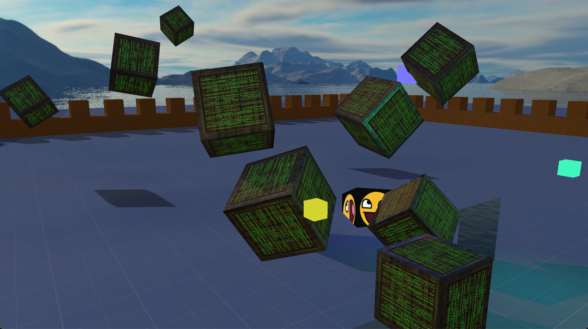

# Hello Triangle

This repo holds my progress as I work through the tutorials on the [Learn OpenGL](https://learnopengl.com/) website. It currently goes up to roughly the directional shadow mapping lesson, prior to point-light shadowing and bump-maps. I skipped over some of the "Advanced Data" sections, including the updated cube-vertices that have a correct winding to allow for face-culling, the VS_IN/VS_OUT stuff, any use of instancing, or the anti-aliasing. The main branch also doesn't have any of the model-loading code in it, but it should be present in a separate branch.

The tutorials build up a more complex scene at some points, then discard it in some others. I kept my slightly more complex scene around through them, and things have gotten... pretty messy. This giant file is a nightmare to read through. I might spend some time reorganizing things later, but for now: this is just a learning scratch-pad space; it is not good code and I would not recommend anyone else try to use it.
